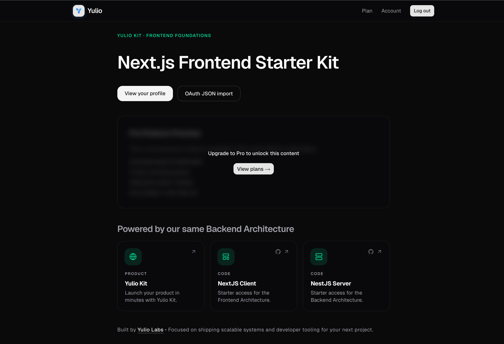

# Next.js Clean Architecture & Multi-Provider Auth

> Part of **[Yulio Labs](https://yuliolabs.com)** — scalable systems and developer tooling for your next product.

<a href="#quick-start">
  
</a>

Companion frontend to the [Yulio NestJS Backend Starter](https://github.com/LynnT-2003/Yulio-NestJS-Backend-Starter).
SPA-style App Router client with no BFF — the browser talks to the API directly via CORS.

- **Multi-provider OAuth**: Google, LINE, GitHub, Discord, Microsoft
- **JWT + refresh token rotation**: Silent refresh on 401, single retry, automatic sign-out on expiry
- **Clean architecture**: MVVM with strict layer separation — domain owns HTTP, views own nothing
- **Stripe payments**: Checkout, billing portal, plan-gated pages out of the box
- **Production-ready**: Based on real-world SaaS needs

## Table of contents

- [Key Highlights](#key-highlights)
- [Stack](#stack)
- [Quick Start](#quick-start)
- [Configuration](#configuration)
- [Architecture](#architecture)
- [Payment & Subscriptions](#payment--subscriptions)
- [Admin User Management & Account Suspension](#admin-user-management--account-suspension)
- [Routes](#routes)
- [Scripts](#scripts)
- [Vercel Deployment](#vercel-deployment)
- [Roadmap](#roadmap)
- [Support](#support)

## Key Highlights

**NetworkManager — the only HTTP layer**

- Singleton that unwraps the Nest `{ success, data, … }` envelope on every call
- Attaches Bearer tokens automatically; retries once after silent refresh on 401
- Never extend it per feature — add `lib/domain/<feature>/<feature>-api.ts` that calls `getRequest` / `postRequest` instead

**MVVM — routes stay thin**

- One screen = one `*PageVm.ts` (state + handlers) + one `*PageView.tsx` (pure render)
- Pages call `use…Vm()` and pass `vm` down — no logic in `app/`
- Domain layer (`lib/domain/`) owns all HTTP calls — views never fetch directly

**Vercel-native**

- Push to main → live in 30 seconds
- Single env var: `NEXT_PUBLIC_API_BASE_URL`

**Account suspension**

- Suspended users stay signed in; blocked routes return 403
- `AccountSuspendedBanner` renders in-app on protected routes
- Session is never cleared on suspension — only on token expiry

**Stripe payment flow**

- `/pricing` — plan cards with active-plan highlight and correct button states
- `/pro-demo` — plan-gated page with blur gate for free users
- Plan card on `/account` polls after Stripe redirect until webhook fires

## Stack

| Layer      | Technology                           |
| ---------- | ------------------------------------ |
| Framework  | Next.js 15 (App Router)              |
| Language   | TypeScript 5                         |
| Styling    | Tailwind CSS + shadcn/ui             |
| State      | React hooks + in-memory token store  |
| HTTP       | Fetch via `NetworkManager` singleton |
| Payments   | Stripe (server-side via Nest API)    |
| Deployment | Vercel                               |

## Quick Start

```bash
cp .env.example .env.local
# Set NEXT_PUBLIC_API_BASE_URL to your Nest origin
npm install
npm run dev
```

Ensure the API's `ALLOWED_ORIGINS` includes `http://localhost:3000`.

## Configuration

### Environment variables

| Variable                   | Purpose                                                                      |
| -------------------------- | ---------------------------------------------------------------------------- |
| `NEXT_PUBLIC_API_BASE_URL` | API root — either `https://api.example.com` or `https://api.example.com/api` |

### OAuth callback

On the **Nest** deployment set:

```
FRONTEND_OAUTH_CALLBACK_URL=https://<your-next-host>/auth/callback
```

The API appends tokens in the `#fragment`. If unset, callbacks return JSON on the API host — use `/auth/oauth-import` to paste that JSON when testing locally.

## Architecture

### NetworkManager — stable contract

**`lib/domain/api/NetworkManager.ts`** is the single place that:

- Unwraps the Nest `{ success, statusCode, data, timestamp }` envelope
- Attaches `Authorization: Bearer <token>` to authenticated calls
- On 401: checks the error `message`, attempts one silent refresh via `POST /api/auth/refresh`, retries — or signs the user out if the token is unrecoverable

```ts
// Every feature module calls these — never fetch directly
getRequest<T>(endpoint)
postRequest<T, B>(endpoint, body)
patchRequest<T, B>(endpoint, body)
deleteRequest<T, B>(endpoint, body?)
```

New feature areas add `lib/domain/<feature>/<feature>-api.ts` — they call `getRequest` / `postRequest` and nothing else.

### MVVM pattern

| Layer                      | Role                                                  |
| -------------------------- | ----------------------------------------------------- |
| `app/**/page.tsx`          | Calls `use…Vm()`, renders `…View` with `vm={…}`       |
| `modules/*/viewModel/*.ts` | Exports `FooPageVm` type + `useFooPageVm()` hook      |
| `modules/*/view/*.tsx`     | Exports `FooPageView({ vm })` — pure render, no fetch |
| `modules/*/components/`    | Dumb UI components scoped to the module               |
| `lib/domain/*/`            | All HTTP — never imported by views directly           |

Example:

```tsx
"use client";
import { useAccountPageVm } from "@/modules/account/viewModel/accountPageVm";
import { AccountPageView } from "@/modules/account/view/AccountPageView";

export default function AccountPage() {
  const vm = useAccountPageVm();
  return <AccountPageView vm={vm} />;
}
```

### Session model

- **Memory**: `lib/domain/api/tokenStore.ts` — access token, refresh token, userId
- **Persistence**: `localStorage` via `lib/domain/auth/session-storage.ts` — survives page reload
- **Logout**: `POST /api/auth/logout` → clear both stores

## Payment & Subscriptions

Stripe is handled server-side on the Nest API. The frontend calls three endpoints and redirects the browser to Stripe-hosted pages.

### Plan states

| `plan`     | `planExpiresAt` | Meaning                          |
| ---------- | --------------- | -------------------------------- |
| `free`     | `null`          | No active subscription           |
| `pro`      | future date     | Active monthly subscription      |
| `pro`      | past date       | Lapsed — subscription expired    |
| `lifetime` | `null`          | One-time purchase, never expires |

### Domain layer

**`lib/domain/payment/paymentApi.ts`** exports:

| Export                                  | Calls                              |
| --------------------------------------- | ---------------------------------- |
| `getUserPlan()`                         | `GET /api/payment/plan`            |
| `createCheckoutSession(body)`           | `POST /api/payment/checkout`       |
| `createBillingPortalSession(returnUrl)` | `POST /api/payment/billing-portal` |
| `PRICE_IDS.pro` / `PRICE_IDS.lifetime`  | Stripe price ID constants          |

### Post-payment flow

1. User clicks **Subscribe** or **Buy once** on `/pricing`
2. Frontend calls `POST /payment/checkout` → receives `{ url }` → `window.location.href = url`
3. User pays on Stripe's hosted page → redirected to `/account?payment=success`
4. `PlanCard` polls `GET /payment/plan` every 2 s (up to 10 s) until webhook fires

Test cards (Stripe test mode): `4242 4242 4242 4242` succeeds · `4000 0000 0000 0002` declines · `4000 0025 0000 3155` triggers 3D Secure. Any future expiry, any 3-digit CVC.

## Admin User Management & Account Suspension

Follows the Nest template's auth vs authorization model: suspended users remain signed in; the API returns `403 Forbidden` + `"Account suspended"` on protected routes.

- **`AccountSuspendedBanner`** renders on all `(protected)` routes when `user.isSuspended`
- **Admin** nav link and `/admin/moderation` require `role === "admin"` and `!user.isSuspended`
- **`ApiError.isAccountSuspended`** is set for 401/403 with the suspension message — session is not cleared

## Routes

| Path                 | Role                                                           |
| -------------------- | -------------------------------------------------------------- |
| `/`                  | Landing + CTAs                                                 |
| `/login`             | Local sign-in + OAuth links                                    |
| `/register`          | Local registration                                             |
| `/pricing`           | **Protected** — plan selection and Stripe checkout             |
| `/account`           | **Protected** — profile + plan card                            |
| `/pro-demo`          | **Protected** — plan-gated demo page                           |
| `/admin/moderation`  | **Protected** — admin only (`role: admin`, not suspended)      |
| `/auth/callback`     | OAuth return when `FRONTEND_OAUTH_CALLBACK_URL` is set on Nest |
| `/auth/oauth-import` | Paste OAuth JSON (local dev fallback)                          |

## Scripts

```bash
npm run dev      # development server
npm run build    # production build
npm run start    # production server
```

## Vercel Deployment

1. Set `NEXT_PUBLIC_API_BASE_URL` in Vercel project settings
2. Push to main → auto-deployed

Ensure `ALLOWED_ORIGINS` on the Nest API includes your Vercel domain.

## Roadmap

**Actively Maintained. Built in public. Production-first.**

1. Admin-User Multi-Provider Authentication ✓
2. Payment Gateway (Stripe) ✓
3. Plan-gated pages ✓
4. Email Automation with Nodemailer and Brevo
5. Reusable Tailwind UI Components + Framer Animations
6. 20+ DaisyUI Themes with Automatic Dark Mode
7. OpenGraph & Meta tags for SEO
8. Complete User Management and Analytics Dashboard
9. Auditing and Moderation for Production SaaS

## Support

If this saves you weeks of work:

- ⭐ Star the repo
- 🚀 Use it in production
- 🧠 Share with your team
- 📍 Connect on [LinkedIn](https://www.linkedin.com/in/lynn-thit-nyi-nyi/) or [Instagram](https://instagram.com/lynn.yuan_)
